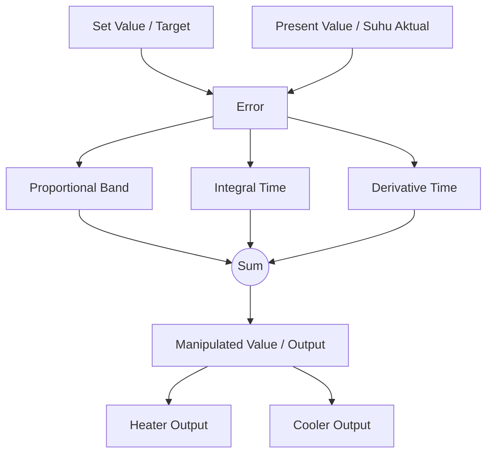

# PID Control Parameter Group

Grup parameter ini berfokus pada pengaturan algoritma *Proportional-Integral-Derivative* (PID) yang merupakan inti dari sistem kontrol suhu Autonics TN Series. Anda dapat melakukan *Auto-tuning* maupun memasukkan konstanta P, I, dan D secara manual untuk pemanasan (Heating) dan pendinginan (Cooling).

- **Function Code:** 
  - `03` (Read Holding Register)
  - `06` (Preset Single Register)
  - `16` (Preset Multiple Registers)
- **Rentang Address:** `400101` hingga `400150`
- **Tipe Data Utama:** INT16

---

## Mekanisme Kontrol PID (Diagram)



---

## Daftar Register PID Control

### 1. Autotuning Execute

Berfungsi untuk menjalankan atau menghentikan proses *Auto-Tuning* (pencarian nilai PID secara otomatis). Ini ekuivalen dengan Coil Address `000002`.

- **Address**: `400101`
- **Hex**: `0x0064`
- **Access**: Read / Write
- **Data Type**: INT16
- **Default**: `0` (OFF)

| Value | Arti |
|---|---|
| `0` | **OFF** - Auto-tuning berhenti/selesai |
| `1` | **ON** - Memulai Auto-tuning |

### 2. Autotuning Mode

Memilih mode operasi untuk Auto-tuning.

- **Address**: `400102`
- **Hex**: `0x0065`
- **Access**: Read / Write
- **Data Type**: INT16
- **Default**: `0` (TUN1)

| Value | Arti |
|---|---|
| `0` | **TUN1** - Standar Auto-tuning |
| `1` | **TUN2** - Auto-tuning dengan perhitungan algoritma khusus untuk meminimalkan overshoot |

---

### Parameter PID Pemanasan (Heating)

| Nama Parameter | Address | Hex | Range | Default |
|---|---|---|---|---|
| **Heating_Proportional Band** | 400103 | `0x0066` | `000.1` hingga `999.9` (℃/℉/%) | `100` (10.0) |
| **Heating_Integral Time** | 400104 | `0x0067` | `0000` hingga `9999` Detik | `240` |
| **Heating_Derivative Time** | 400105 | `0x0068` | `0000` hingga `9999` Detik | `49` |

> [!NOTE]
> Jika **Proportional Band** disetel ke `0` (atau mendekati batas), sistem akan bertindak seperti kontrol ON/OFF biasa (Bukan PID).

---

### Parameter PID Pendinginan (Cooling)

Hanya berfungsi jika kontroler mendukung tipe kontrol pemanasan-pendinginan (H-C).

| Nama Parameter | Address | Hex | Range | Default |
|---|---|---|---|---|
| **Cooling_Proportional Band** | 400106 | `0x0069` | `000.1` hingga `999.9` (℃/℉/%) | `100` (10.0) |
| **Cooling_Integral Time** | 400107 | `0x006A` | `0000` hingga `9999` Detik | `240` |
| **Cooling_Derivative Time** | 400108 | `0x006B` | `0000` hingga `9999` Detik | `49` |

---

### Pengaturan Lanjutan PID

#### 1. ANTI RESET WINDUP BAND

Mencegah *over-integration* yang bisa menyebabkan suhu "kebablasan" (*overshoot*) saat pertama kali naik menuju Set Value.

- **Address**: `400109`
- **Hex**: `0x006C`
- **Range**: `0` (OFF), `50` hingga `200` (%)
- **Default**: `0` (OFF)

#### 2. 2DOF CONSTANT (Alpha)

Konstanta Alpha untuk algoritma 2-Degree-Of-Freedom (2DOF) PID. Mengontrol keagresifan respons terhadap perubahan target (Set Value) dibandingkan gangguan luar (*disturbance*).

- **Address**: `400110`
- **Hex**: `0x006D`
- **Range**: `0` hingga `100` (%)
- **Default**: `60`

---

### Zone PID Control

Fitur Zone PID membagi rentang suhu sensor menjadi beberapa "Zona". Masing-masing zona dapat menggunakan grup parameter PID yang berbeda secara otomatis. Sangat berguna pada tungku/mesin yang perilaku termalnya berbeda jauh di suhu rendah vs suhu tinggi.

| Nama Parameter | Address | Hex | Range / Keterangan | Default |
|---|---|---|---|---|
| **Zone_Use** | 400111 | `0x006E` | Mengaktifkan Zone PID (`0`: OFF, `1`: ON) | `0` (OFF) |
| **Zone_RP_L** | 400112 | `0x006F` | Referensi batas bawah (Zona 1) | Min + 25% F.S. |
| **Zone_RP_C** | 400113 | `0x0070` | Referensi batas tengah (Zona 2) | Min + 50% F.S. |
| **Zone_RP_H** | 400114 | `0x0071` | Referensi batas atas (Zona 3) | Min + 75% F.S. |
| **Zone_HYS** | 400115 | `0x0072` | Histeresis saat pindah antar zona (1-100 Digit) | `2` |

- **Reserved**: `400116` hingga `400150` (Kosong)

---

## Contoh Modbus (Menjalankan Auto-Tuning)

Untuk menjalankan Auto-tuning via Modbus, kita harus menulis nilai `1` ke register `400101`.

```cpp
#include <ModbusMaster.h>

ModbusMaster node;

void setup() {
  Serial.begin(115200);
  Serial2.begin(9600, SERIAL_8N1, 16, 17);
  node.begin(1, Serial2);
}

void loop() {
  // Fungsi dipanggil saat menekan tombol di Web UI / HMI
  startAutoTuning();
  delay(5000); // Demo call
}

void startAutoTuning() {
  // Menulis nilai 1 (ON) ke register 400101 (Offset 0x0064)
  uint8_t result = node.writeSingleRegister(0x0064, 1);
  
  if (result == node.ku8MBSuccess) {
    Serial.println("Auto-Tuning berhasil dimulai!");
  } else {
    Serial.println("Gagal memulai Auto-Tuning.");
  }
}
```
