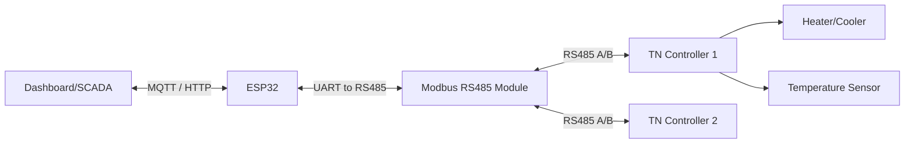

# Dokumentasi TN Series Modbus Communication

Dokumentasi ini adalah versi Markdown dari **Autonics TN Series Two-Degree-of-Freedom PID Temperature Controllers Communication Manual**. Dokumentasi ini dirancang agar lebih mudah dipahami oleh developer *firmware*, *backend*, engineer PLC, SCADA, dan ESP32, tanpa perlu membuka PDF asli.

## Daftar Isi Dokumentasi

Berikut adalah struktur folder dan cara membaca dokumentasi ini:

- `README.md` - Halaman utama ini.
- `01_Modbus_Basic.md` - Dasar-dasar protokol Modbus RTU & ASCII.
- `02_Coil_Map.md` - Pemetaan Coil (*Read/Force Coil*).
- `03_Discrete_Input.md` - Pemetaan Input Diskrit (*Read Discrete Input*).
- `04_Input_Register.md` - Pemetaan Input Register (*Read Input Register*).
- `05_Operation_Parameter.md` - Parameter operasi (400001+).
- `06_MultiSV.md` - Parameter Multi SV (400051+).
- `07_PID_Control.md` - Parameter Kontrol PID (400101+).
- `08_Input_Parameter.md` - Parameter Input Sensor (400151+).
- `09_Pattern_Parameter.md` - Parameter Pola Operasi (400201+).
- `10_Control_Parameter.md` - Parameter Kontrol Lanjutan (400301+).
- `11_PID_Group.md` - Parameter Grup PID 0 - 7 (400351+).
- `12_Event_Parameter.md` - Parameter Event (400451+).
- `13_Alarm_Output.md` - Output Alarm (400551+).
- `14_Communication.md` - Konfigurasi Komunikasi (400601+).
- `15_Other_Parameter.md` - Parameter Lainnya & Masking.
- `16_User_Parameter.md` - Grup Parameter User (DAQMaster).
- `17_PLC_Register.md` - Mapping Register untuk PLC.
- `Appendix.md` - Informasi tambahan seperti kode fungsi, error exception, format frame, dan troubleshooting.

## Topologi Modbus (Contoh ESP32 + RS485 + TN Controller)

Berikut adalah arsitektur sistem yang umum digunakan dalam menghubungkan perangkat IoT ke Autonics TN Series menggunakan Modbus RTU melalui RS485.



## Daftar Function Code yang Didukung

Autonics TN Series mendukung beberapa *Function Code* standar Modbus untuk membaca atau menulis data:

| Function Code (Hex) | Nama Fungsi | Deskripsi |
| --- | --- | --- |
| `01` (`0x01`) | Read Coil Status | Membaca status ON/OFF dari output (0X reference). |
| `02` (`0x02`) | Read Input Status | Membaca status ON/OFF dari input (1X reference). |
| `03` (`0x03`) | Read Holding Registers | Membaca data biner dari holding registers (4X reference). |
| `04` (`0x04`) | Read Input Registers | Membaca data biner dari input registers (3X reference). |
| `05` (`0x05`) | Force Single Coil | Mengubah satu koil menjadi ON atau OFF (0X reference). |
| `06` (`0x06`) | Preset Single Register | Menulis data biner ke satu holding register (4X reference). |
| `16` (`0x10`) | Preset Multiple Registers | Menulis data ke beberapa holding registers secara berurutan. |

## Daftar Register Group

Parameter pada TN Series dibagi berdasarkan jenis akses register Modbus:

| Group | Address | Range | Function Code | Deskripsi |
| --- | --- | --- | --- | --- |
| **Coil Status** | 000001+ | 000001 - 000050 | `01`, `05` | Kontrol RUN/STOP, Alarm Reset |
| **Discrete Inputs** | 100001+ | 100001 - 100100 | `02` | Status indikator (Suhu, LED, Event) |
| **Input Status** | 300101+ | 300101 - 300200 | `04` | Informasi versi perangkat & identitas keras |
| **Input Registers** | 301001+ | 301001 - 301050 | `04` | Pembacaan PV, Nilai output saat ini |
| **Holding Registers** | 400001+ | 400001 - 400750 | `03`, `06`, `16` | Parameter operasional (SV, PID, Alarm, Komunikasi) |
| **User Parameters** | 401022+ | 401022 - 402050 | `03`, `06`, `16` | Register yang dapat dikustomisasi |

## Contoh Komunikasi

Untuk komunikasi Modbus, selalu gunakan format Data Address yang tepat.

**Request: Read Holding Register (Baca Set Value pada address `400006`)**

- ID: `1`
- Function Code: `03`
- Address: `0x0005` (Hex dari 400006 - 400001 = 5)
- Quantity: `0x0001`

**Contoh kode Arduino/ESP32 (ModbusMaster):**

```cpp
#include <ModbusMaster.h>

ModbusMaster node;

void setup() {
  Serial.begin(115200);
  Serial2.begin(9600, SERIAL_8N1, 16, 17); // RS485 RX, TX
  node.begin(1, Serial2); // ID TN Controller = 1
}

void loop() {
  uint8_t result;
  
  // Membaca Set Value (Address 400006 -> Offset 0x0005)
  result = node.readHoldingRegisters(0x0005, 1);
  
  if (result == node.ku8MBSuccess) {
    Serial.print("Set Value: ");
    Serial.println(node.getResponseBuffer(0));
  } else {
    Serial.println("Gagal membaca Set Value");
  }
  
  delay(1000);
}
```

---
*Gunakan file-file di folder ini untuk mempelajari masing-masing register secara detail.*
